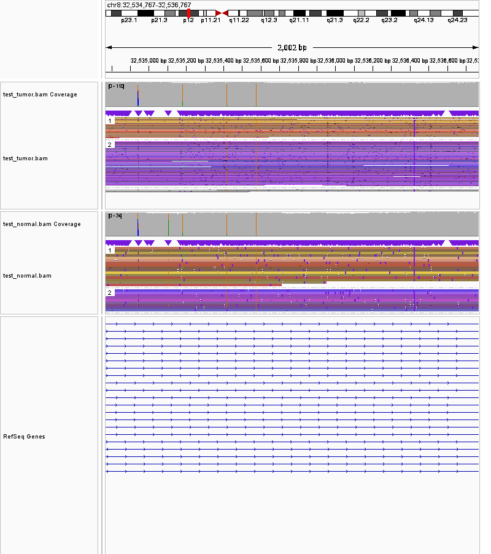
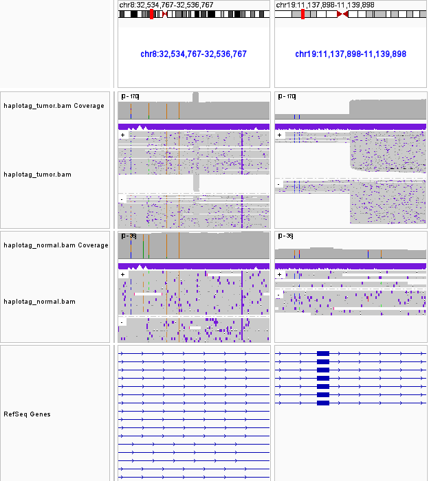
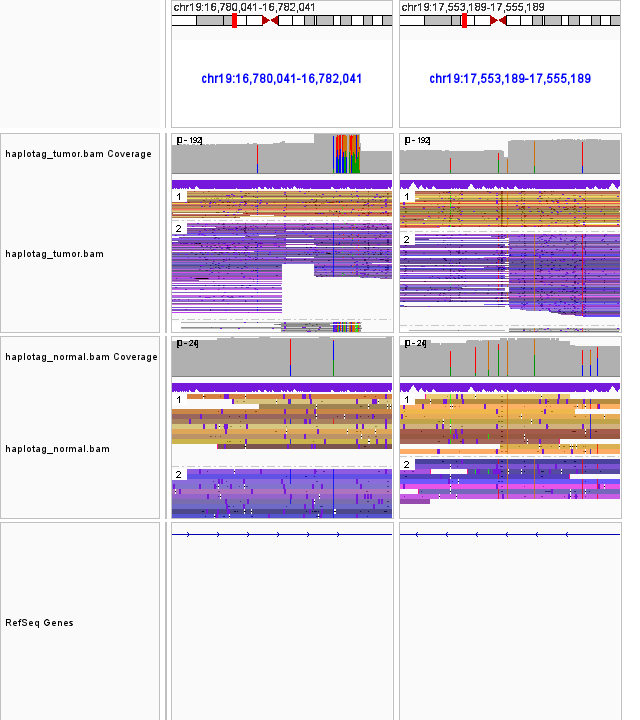
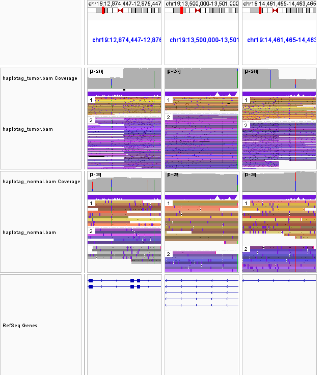

# IGVer
Conveniently take IGV snapshots in multiple bam files over mutliple regions.

## Prerequisites
- The standard way of running `igver.py` is through docker or singularity. 
- Supports genomes listed in the [#hosted-genome-list](https://github.com/igvteam/igv/wiki/Downloading-Hosted-Genomes-for-Offline-Use#hosted-genome-list) from the IGV team.

## Call for help
- IGVer isn't battle-hardened at all; any help/push/feedback will greatly help improving it! :pray:

## Usage
- `igver.py --help` gives:
```bash
usage: igver.py [-h] --bam BAM [BAM ...] -r REGIONS -o OUTDIR [-g GENOME]
                [-t TAG] [-mph MAX_PANEL_HEIGHT] [-od OVERLAP_DISPLAY]
                [--overwrite] [-d IGV_DIR] [--config CONFIG]

Create temporary batchfile and run IGV for a region list

optional arguments:
  -h, --help            show this help message and exit
  --bam BAM [BAM ...]   Input tumor bam file(s) to be shown vertically
  -r REGIONS, --regions REGIONS
                        Either a 'chr:start-end' string, or input regions file
                        with region columns to be shown horizontally
  -o OUTDIR, --outdir OUTDIR
                        Output png directory
  -g GENOME, --genome GENOME
                        Genome version [default: 'GRCh37']
  -t TAG, --tag TAG     Tag to suffix your png file [default: 'tumor']
  -mph MAX_PANEL_HEIGHT, --max_panel_height MAX_PANEL_HEIGHT
                        Max panel height [default: 200]
  -od OVERLAP_DISPLAY, --overlap_display OVERLAP_DISPLAY
                        'expand', 'collapse' or 'squish'; [default: 'squish']
  --overwrite           Overwrite existing png files [default: False]
  -d IGV_DIR, --igv_dir IGV_DIR
                        /path/to/IGV_x.xx.x
  --config CONFIG       Additional preferences [default: None]
```

### Additional IGV preferences
- You can plug in additional IGV preferences as in https://github.com/igvteam/igv/wiki/Batch-commands -- an example would be `test/tag_haplotype.batch`:
```
group TAG HP
colorBy TAG rl
sort READNAME
```

### Caveat: setting IGV screenshot width
- AFAIK, the only way to modify the batch screenshot width is by modifying your `${IGV_DIR}/prefs.properties` file. There is a line that looks something like `IGV.Bounds=0,0,640,480`, meaning that IGV set the bounds of the left, top, width, height (refer to https://github.com/igvteam/igv/issues/161). I've tried to override this but seems that it doesn't work that way. For the example below, I've fixed my prefs.properties file so that the screenshot width is 800 (i.e. set `IGV.Bounds=0,0,800,480`).

## Run example
- An example command getting two bam files as inputr, displayed vertically in the order put in (i.e. top panel: `haplotag_tumor.bam`, bottom panel: `haplotag_normal.bam`), is as follows.
- Here, `test/tag_haplotype.batch` includes additional IGV preferences to group and color haplotagged reads, as written above.
```bash
singularity run -B /juno docker://shahcompbio/igv igver.py \
    --bam test/test_tumor.bam test/test_normal.bam \
    -r test/region.txt \
    -o test/snapshots \
    -mph 500 -od squish \
    --config test/tag_haplotype.batch
```
- The regions file for the test case, `test/region.txt`, includes 4 lines of different regions. The number of regions in the same line will lead to a snapshot with the regions horizontally aligned. You can annotate the region with an optional final field, which you can omit.
- Here's the content of `test/region.txt` and some explanation below.
```
8:32534767-32536767 region_of_interest
8:32534767-32536767 19:11137898-11139898 translocation
19:16780041-16782041 19:17553189-17555189 inversion
19:12874447-12876447 19:13500000-13501000 19:14461465-14463465 duplication
```
1. The first region will take a 1001bp;1001bp snapshot on the region coined "region of interest", and create a png file `8-32534767-32536767.region_of_interest.tumor.png` in the OUTDIR.
2. The second region will take a 1001bp;1001bp snapshot on the two breakpoints of the translocation, and create a png file `8-32534767-32536767.19-11137898-11139898.translocation.tumor.png` in the OUTDIR.
3. The third region will take a 1001bp;1001bp snapshot on the two breakpoints of the inversion, and create a png file `19-16780041-16782041.19-17553189-17555189.inversion.tumor.png` in the OUTDIR.
4. The fourth region will take a 1001bp;1001bp;1001bp snapshot on the two breakpoints and a region inbetween, and create a png file `19-12874447-12876447.19-13500000-13501000.19-14461465-14463465.duplication.tumor.png` in the OUTDIR.
- You can see that the png files in OUTDIR includes `.tumor` as a suffix. This is because the default TAG of the `--tag / -t` option is "tumor". You can set it to "None" to omit tagging the suffix.

## Example results
- You can see the IGV snapshots already taken using the script above in `test/snapshots`.

1. [region_of_interest](test/snapshots/8-32534767-32536767.region_of_interest.tumor.png) <br>

2. [translocation](test/snapshots/8-32534767-32536767.19-11137898-11139898.translocation.tumor.png) <br>

3. [inversion](test/snapshots/19-16780041-16782041.19-17553189-17555189.inversion.tumor.png) <br>

4. [duplication](test/snapshots/19-12874447-12876447.19-13500000-13501000.19-14461465-14463465.duplication.tumor.png)<br>


